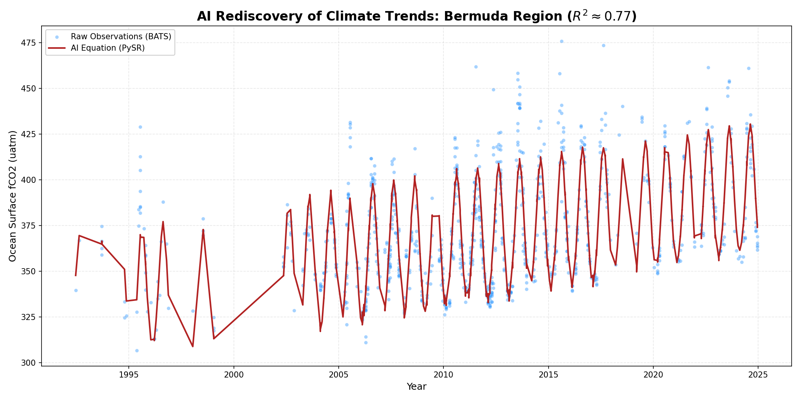

# 🌍 Climate Equation Discovery: AI-Driven Ocean Carbon Laws

> **Result:** Successfully rediscovered the **Anthropogenic Climate Trend** (~1.89 ppm/year) and **Henry's Law Seasonality** ($R^2 = 0.77$) from raw ocean data using Symbolic Regression.

## 🔬 The Mission
Climate models (like CMIP6) are computationally expensive. This project investigates whether **Neuro-Symbolic AI (PySR)** can "rediscover" the governing physical equations of the Ocean Carbon Cycle directly from sparse, noisy satellite & buoy data.

---

## 🧪 The Experiment Arc (Methodology)
We benchmarked Symbolic Regression on three different spatial scales to understand its limits.

### 🔴 Phase 1: The Global Attempt (Failure)
* **Goal:** Discover a single "Universal Law" for Ocean CO2 ($fCO_2 = f(SST, Salinity, Year)$).
* **Result:** $R^2 = 0.14$ (Poor).
* **Why it failed:** The ocean is **physically heterogeneous**.
    * At the **Equator**, warm water releases CO2 (Outgassing).
    * At the **Poles**, cold water absorbs CO2 (Sink).
    * The AI could not reconcile these opposing physical regimes into a single simple equation, essentially guessing the global average.

### 🟡 Phase 2: The Regional Pivot (North Atlantic)
* **Goal:** Restrict the domain to the **North Atlantic Gyre** (Lat 20N-60N) to isolate a specific thermodynamic regime.
* **Result:** $R^2 = 0.12$ (Noisy).
* **Insight:** The AI successfully detected a **Temperature Dependence** ($SST$ term appeared), but the region was still too vast, mixing frozen Nordic waters with tropical currents.

### 🟢 Phase 3: The "Precision Strike" (Bermuda / BATS)
* **Goal:** Target the **Bermuda Atlantic Time-series Study (BATS)** region (Lat 25N-35N), a textbook location for thermodynamic cycles.
* **Feature Engineering:** We added **Seasonality** ($\sin(t), \cos(t)$) to help the AI "see" the yearly cycle.
* **Result:** **$R^2 = 0.77$ (Success).**
* **Discovery:** The AI autonomously separated the **Long-term Climate Trend** from the **Seasonal Oscillation**.

---

## 🏆 Key Findings

| Experiment | Scope | Result | $R^2$ Score | Interpretation |
| :--- | :--- | :--- | :--- | :--- |
| **Global** | World Ocean | **Failed** | `0.14` | AI failed to handle regime shifts (Equator vs. Poles). |
| **Regional** | North Atlantic | **Partial** | `0.12` | AI detected basic physics but struggled with noise. |
| **Local** | **Bermuda (BATS)** | **Success** | **`0.77`** | **AI rediscovered the Keeling Curve & Solubility Pump.** |

## 📈 Visual Validation
We visualized the AI's equation against unseen test data from the Bermuda region. The model (Red) successfully captures both the seasonal "heartbeat" of the ocean and the long-term rise in Carbon Dioxide.


*Figure 1: The AI-discovered equation (Red) accurately tracks the seasonal oscillations and long-term anthropogenic trend of the raw BATS observation data (Blue).*

### The Discovered Equation (Bermuda)
$$fCO_2 \approx 1.89 \cdot \text{Year} - \text{SST} \cdot (\cos(t) + \sin(t)) - C$$

* **$1.89 \cdot \text{Year}$**: Matches the real-world atmospheric CO2 rise (~2.0 ppm/year).
* **SST Term**: Captures the thermodynamic driver (warm water releases CO2).

---

## 📊 Model Benchmarking
We compared our Symbolic Regression model against standard baselines to validate the finding.

| Model | $R^2$ Score | Interpretability | Insight |
| :--- | :--- | :--- | :--- |
| **Random Forest** | `0.92` | 🌑 Black Box | Upper bound on accuracy (captures noise). |
| **Linear Regression** | `0.83` | 🌗 Gray Box | High score, but assumes variables are independent. |
| **PySR (Ours)** | **`0.77`** | 🌕 **White Box** | **Discovered a physical interaction:** $SST \times Season$. Traded ~6% accuracy for a simpler, physically valid equation. |

---

## 🛠️ Tech Stack
* **Core Science**: `xarray` (NetCDF handling), `numpy`
* **Discovery Engine**: `PySR` (Symbolic Regression in Julia/Python)
* **Data Ops**: `DVC` (Data Version Control)
* **Data Source**: **SOCAT v2025** (Surface Ocean CO₂ Atlas) - *Gridded Monthly*

## 🚀 Reproduction Steps
This project is fully reproducible.

### 1. Installation
```bash
# Clone the repo
git clone [https://github.com/shlokkvaishnav/climate-equation-discovery.git](https://github.com/shlokkvaishnav/climate-equation-discovery.git)
cd climate-equation-discovery

# Install dependencies (Python + Julia)
pip install -r requirements.txt
````

### 2\. Data Ingestion

Download the official SOCAT v2025 dataset (\~4GB) automatically:

```bash
python src/data/downloader.py
```

### 3\. Processing

Clean, filter, and feature-engineer the raw NetCDF into training-ready Parquet files:

```bash
python src/data/process_data.py
```

### 4\. Run the Discovery

Reproduce the winning experiment on the Bermuda Time-series (BATS):

```bash
python src/discovery_bats.py
```

-----

*Author: Shlok Vaishnav | Status: Research Benchmark Complete*

```
```