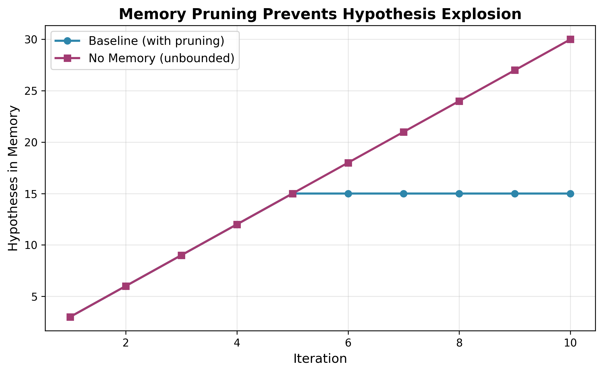
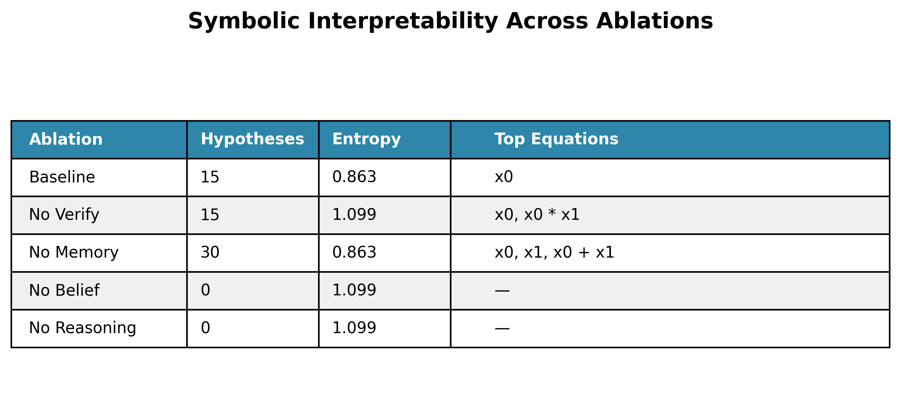

# SD-MoSE: Self-Directed Mixture-of-Symbolic-Experts

> **Autonomous Climate Equation Discovery Through Agentic Reasoning**

An agentic framework for discovering interpretable scientific equations from multi-regime observational data. SD-MoSE implements an autonomous loop of observation, reasoning, verification, and learning that converges when symbolic explanations and regime beliefs stabilize.

---

## 🎯 Key Features

- **Autonomous Agent**: Self-directed iteration with explicit hypothesis management
- **Physics-Based Verification**: Rejects equations violating conservation laws or thermodynamic constraints
- **Multi-Regime Discovery**: Tracks probabilistic beliefs over distinct climate states
- **Selective Memory**: Strategic hypothesis curation prevents unbounded growth
- **Interpretable Outputs**: Symbolic equations instead of black-box predictions

---

## 🏗️ Architecture

The agent consists of five core components: `(Π, H, V, M, B)`

- **Π (Perception)**: Converts raw observations into structured features
- **H (Hypothesis Space)**: Symbolic equation objects with `(equation, regime, likelihood, complexity, score, timestamp)`
- **V (Verification)**: Physics constraint validation with detailed logging
- **M (Memory)**: Top-5 hypotheses per regime with automatic pruning
- **B (Belief)**: Probabilistic regime assignments updated via Bayesian inference

### Agent Loop

```
Observe → Retrieve → Reason → Verify → Learn → Converge
   ↓         ↓         ↓         ↓        ↓        ↓
 Data    Priors    Symbolic  Physics  Beliefs  Stable
         +Memory   Equations Checks   +Memory  State
```

**Autonomous Convergence**: The agent stops when both belief distributions and hypothesis sets stabilize.

---

## 📊 Validation Results

Component necessity validated through ablation experiments:

### Hypothesis Growth Over Time



**Result**: Disabling memory pruning causes hypothesis count to double (15 → 30), demonstrating that selective forgetting is essential for scalability.

---

### Belief Concentration Analysis


**Result**: Only the complete agent achieves belief concentration (entropy = 0.863). Removing verification, belief updates, or reasoning maintains maximal entropy (1.099), preventing regime specialization.

---

### Symbolic Interpretability



**Result**: 
- **Baseline**: Compact symbolic equations with specialized beliefs
- **No Verify**: Diverse equations without regime commitment
- **No Memory**: Uncontrolled hypothesis proliferation
- **No Belief/Reasoning**: Zero interpretable outputs

---

## 🔬 Key Findings

**Empirical validation**:
1. ✅ Memory pruning prevents unbounded growth
2. ✅ Physics verification enables belief concentration
3. ✅ Belief updates actively gate hypothesis storage
4. ✅ Symbolic reasoning provides interpretability

**Insight**: Interpretability emerges from the interaction of all components—no single module is sufficient.

---

## 🚀 Quick Start

### Installation

```bash
# Clone repository
git clone https://github.com/shlokkvaishnav/climate-equation-discovery.git
cd climate-equation-discovery

# Install dependencies
pip install -r requirements.txt
```

### Running Experiments

The core mechanism for discovering equations is the SDMoSE Python API. We have recently upgraded the gating module to explicitly leverage a **Symbolic Gate Function (SGF)** for physically-enforced interpretability.

### Basic Usage

```python
from sdmose.agent.agent import SDMoSEAgent
from sdmose.experts.symbolic_gate import SymbolicGate

# Configure the agent programmatically
config = {
    # Example agent hyperparams...
}

# The routing agent assigns covariates to regimes using the sparse SGF layer
symbolic_gate = SymbolicGate(num_inputs=4, num_experts=3)

# Initialize agent
agent = SDMoSEAgent(config)

# Run until convergence
agent.run(data_loader, max_iterations=100)

# Inspect results
state = agent.introspect()
print(f"Final hypotheses: {state['num_hypotheses']}")
print(f"Belief state: {state['belief']}")
print(f"Top equations: {state['top_equations']}")
```

---

## 📁 Project Structure

```
climate-equation-discovery/
├── sdmose/                  # Core agent implementation
│   ├── agent/
│   │   ├── agent.py        # Agent orchestrator
│   │   ├── perception.py   # Observation encoding
│   │   ├── reasoning.py    # Symbolic hypothesis generation
│   │   ├── hypothesis.py   # First-class hypothesis objects
│   │   ├── belief.py       # Bayesian regime tracking
│   │   ├── memory.py       # Strategic curation
│   │   └── retrieval.py    # Prior + memory access
│   ├── experts/
│   │   └── symbolic_gate.py# Interpretable symbolic routing logic
│   ├── science/
│   │   ├── constraints.py  # Physics verification
│   │   └── scoring.py      # Composite scoring
│   └── data/
│       └── preprocess.py   # Data pipeline
├── scripts/
│   ├── run_ablations.py    # Automated experiments
│   └── plot_diagnostics.py # Visualization
└── docs/
    ├── methods_paper.md    # Detailed methods
    └── methods_agent.md    # Architecture details
```

---

## 🔍 Technical Details

### Hypothesis Scoring

```python
score = -MSE(y, ŷ) - 10·violations - 0.01·complexity
```

Balances data fit, physical plausibility, and equation simplicity.

### Belief Update

```python
π_k ∝ exp(Σ score(h) / T)  # Softmax over regime scores
```

With entropy regularization to prevent premature regime collapse.

### Memory Pruning

- Retain top-5 hypotheses per regime
- Sort by composite score
- Log pruned hypotheses with timestamps for analysis


---

## 📄 License

MIT License - see [LICENSE](LICENSE) for details.

---

## 🤝 Contributing

Contributions welcome! Please open an issue or pull request.

---

## 📧 Contact

**Shlok Vaishnav**  
GitHub: [@shlokkvaishnav](https://github.com/shlokkvaishnav)

---

**Built with**: Python 3.10+ | PySR | NumPy | Matplotlib
