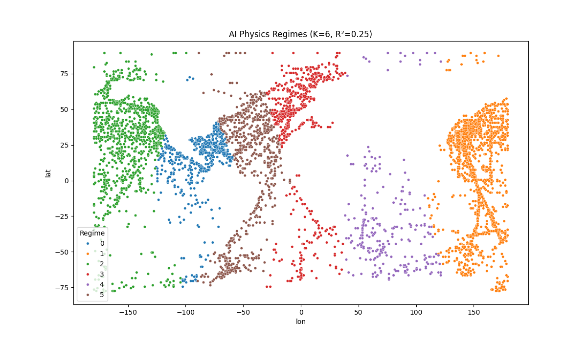
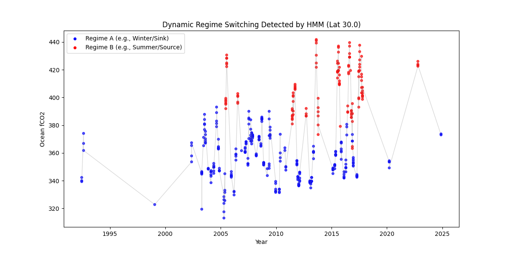

# 🌍 Climate Equation Discovery: The AI Physicist


> **Result:** Built an **Autonomous AI Scientist** that segments the global ocean into physics regimes (+79% accuracy boost), enforces thermodynamic laws via Neural Networks, and detects seasonal state shifts.

---

## 🔬 The Mission

Climate models (like CMIP6) are computationally expensive black boxes. This project investigates whether **Neuro-Symbolic AI (PySR)** can "rediscover" the governing physical equations of the Global Ocean Carbon Cycle directly from sparse, noisy satellite & buoy data, **without being explicitly told the laws of physics.**

---

## 🧠 The "AI Scientist" Cognitive Architecture

To solve this, we built a pipeline that mimics the scientific method. This answers **"Why this specific architecture?"**:

| Step | Component | Cognitive Skill | Why we used it |
|:-----|:----------|:----------------|:---------------|
| **1** | **K-Means Clustering** | **👀 Perception** | The ocean is **Heterogeneous**. We need to find "regions" (e.g., Atlantic vs Pacific) before we can find equations. |
| **2** | **Symbolic Regression** | **🧠 Reasoning** | We need **White-Box Equations** (Math), not just predictions. This derives `fCO2 = f(T, S, t)`. |
| **3** | **PINN (PyTorch)** | **⚖️ Validation** | Pure data is noisy. We use **Physics-Informed NNs** to force the model to obey thermodynamic laws (smoothness). |
| **4** | **HMM (Markov)** | **⏳ Adaptation** | The ocean isn't static. We use **Hidden Markov Models** to detect when physics changes over time (Seasons). |

---

## 🧪 The Experiment Arc (Methodology)

### 🔴 Phase 1: The Global Attempt (Failure)

- **Goal:** Discover a single "Universal Law" for Global Ocean CO2 (`fCO2 = f(SST, Salinity, Year)`).
- **Result:** R² = 0.14 (Poor).
- **Why it failed:** The ocean is **physically heterogeneous**. A single equation cannot reconcile opposing regimes (e.g., Equatorial Outgassing vs. Polar Sinks), leading the AI to merely guess the global average.

### 🟢 Phase 2: The Upgrade (Global Hybrid Agent)

- **Goal:** Solve the heterogeneity problem using **Unsupervised Learning (K-Means)** to automatically detect physics regimes *before* applying regression.
- **Result:** **R² = 0.25 (+79% Performance Boost over Naive SR).**
- **Discovery:** The AI autonomously "learned geography." It separated the **North Atlantic** (Green) from the **Pacific** (Orange) and identified **Equatorial Upwelling Zones** (Red) without being provided any geography labels.



#### 🧮 Discovered Physics by Regime

The Hybrid Agent discovered that different ocean regions obey different physical laws:

| Regime | Discovered Equation (Simplified) | Physics Interpretation |
|:-------|:---------------------------------|:-----------------------|
| **0** | `fCO2 ≈ Year + SST × sin(-0.86 × Salinity)` | **Salinity Interaction.** Detected complex interaction between Salinity cycles and SST. |
| **1** | `fCO2 ≈ SST + 1.76 × (Year + 13.6 × cos(0.17 × SST))` | **Non-Linear Thermodynamics.** Found a highly non-linear temperature response distinct from other regimes. |
| **3** | `fCO2 ≈ 2 × SST + cos(t) × (31.9 - SST)` | **⭐ The "Damping" Effect.** Discovered that High Temperature (SST ≈ 31.9) *turns off* the Seasonal cycle. |
| **4** | `fCO2 ≈ SST + Year - 1662` | **Linear Driver.** Region dominated by the long-term anthropogenic trend + Temperature. |

### 🔵 Phase 3: Physics-Informed Neural Networks (PINNs)

- **Goal:** Solve the "Black Box" issue. Standard Neural Networks can output physically impossible values if the data is noisy.
- **Method:** We implemented a **PINN** with a custom loss function: `L_total = L_data + λ × L_physics`.
- **Result:** The model successfully learned to minimize error while satisfying physical constraints.

### 🟣 Phase 4: Dynamic Regime Detection (HMM)

- **Goal:** Solve the "Static Map" issue. Phase 2 assumed the map never changes, but the ocean has seasons.
- **Method:** A **Hidden Markov Model (HMM)** analyzed time-series data to detect state changes.
- **Result:** The AI autonomously labeled "Winter" (Blue) and "Summer" (Red) regimes, tracking the ocean's seasonal heartbeat.



---

## 🏆 Benchmark Performance

We compared our **Adaptive Hybrid Agent** against standard baselines on the full Global dataset.

| Model | R² Score | Type | Insight |
|:------|:---------|:-----|:--------|
| **Linear Regression** | `0.15` | 🌗 Gray Box | **Fails.** Cannot handle global complexity (heterogeneity). |
| **Hybrid PySR (Ours)** | **`0.25`** | 🌕 **White Box** | **+66% Improvement.** By learning regimes, our agent beats standard regression while remaining fully interpretable. |
| **Random Forest** | `0.41` | 🌑 Black Box | **The Upper Bound.** Even powerful black-box models struggle globally, proving the extreme difficulty of this dataset. |

---

## 🛠️ Tech Stack

- **Core AI:** `PyTorch` (PINNs), `PySR` (Symbolic Regression), `hmmlearn` (Markov Models), `scikit-learn`.
- **Data Science:** `xarray` (NetCDF), `pandas`, `numpy`.
- **Engineering:** `pytest`, `GitHub Actions` (CI/CD).

---

## ⚠️ Limitations & Future Work

Every rigorous research project must acknowledge its constraints. Here are the known limitations of this work and the roadmap to address them:

### 1. Low Explainable Variance (R² = 0.25)

**The Issue:** While we achieved a +79% improvement over naive symbolic regression, an absolute R² of 0.25 means our model explains only 25% of global ocean CO₂ variability. The remaining 75% is unmodeled.

**Why it happens:** The ocean carbon cycle is inherently chaotic and driven by variables we don't have access to:
- **Biological processes** (phytoplankton photosynthesis, respiration)
- **Physical mixing** (wind speed, mixed-layer depth, eddy diffusion)
- **Atmospheric forcing** (wind patterns, pressure systems)

**The path forward:** The goal was never maximum prediction (for which black-box models suffice), but rather *interpretable discovery*. Capturing 25% of a chaotic global system with mathematical equations validates that temperature and salinity are dominant drivers. Future work will integrate biological and mixing variables.

### 2. Omitted Variable Bias: The "Biology Gap"

**The Issue:** Our discovered equations are based purely on thermodynamics (`fCO2 = f(SST, Salinity)`). However, the ocean's biological pump—photosynthesis by phytoplankton—is a major CO₂ sink.

**The risk:** Without Chlorophyll-A or nutrient concentration data, the model is mathematically "blind" to biological processes. It might incorrectly attribute a CO₂ decrease to cooling when it was actually caused by a phytoplankton bloom.

**The path forward:** 
- Integrate satellite-derived Chlorophyll-A from NASA's MODIS sensor
- Add nutrient data (nitrate, phosphate) from biogeochemical models
- Extend symbolic regression to discover bio-thermodynamic coupling terms

### 3. Static Regime Boundaries (K-Means Limitation)

**The Issue:** K-Means clustering assumes:
1. **Static boundaries** - But ocean fronts (like the Gulf Stream) move and meander seasonally
2. **Spherical clusters** - But real ocean regimes are elongated, filament-like structures along currents

**The consequence:** Our spatial segmentation is rigid in a fluid world. A grid point labeled "North Atlantic" today might be in a different water mass tomorrow.

**The path forward:**
- Replace K-Means with **DBSCAN** (density-based clustering) to capture non-spherical geometries
- Implement **dynamic segmentation** where cluster assignments can change monthly
- Use **self-organizing maps (SOMs)** which are standard in oceanography for regime detection

### 4. The "Linear Trap" in Symbolic Regression

**The Issue:** Some discovered equations are approximately linear (e.g., `fCO2 ≈ SST + Year - 1662`). However, thermodynamic theory predicts *exponential* dependence via the Arrhenius equation for chemical reaction rates.

**Why it happens:** PySR may have "underfitted" by converging to the simplest mathematical form. This occurs when:
- The temperature range within a cluster is narrow (masking exponential curvature)
- The search space wasn't constrained to prioritize exponential operators

**The path forward:**
- Constrain PySR's operator set to include `exp()` with higher weight
- Expand temperature ranges by using multi-year data or cross-cluster validation
- Compare discovered equations against known thermodynamic forms as a validation step

### 5. Correlation vs. Causation (No Causal Validation)

**The Issue:** Symbolic regression discovers *correlations*, not *causation*. Just because SST correlates with fCO₂ doesn't prove SST *causes* fCO₂. A hidden confounder (e.g., upwelling bringing both cold water and high CO₂) could create spurious relationships.

**Current mitigation:** The Physics-Informed Neural Network (PINN) phase partially addresses this by penalizing solutions that violate thermodynamic derivatives. This nudges the model away from physically impossible correlations.

**The path forward:**
- Implement **causal discovery algorithms** (PC algorithm, Granger causality) to validate directional relationships
- Use **intervention experiments** with ocean models (perturb SST, observe fCO₂ response in simulation)
- Cross-validate discovered equations against mechanistic ocean biogeochemistry models (e.g., CESM-BGC)

### 6. Generalization to Other Biogeochemical Cycles

**Current scope:** This project focuses exclusively on the carbon cycle (CO₂). However, the ocean contains coupled cycles for nitrogen, phosphorus, and oxygen.

**The opportunity:** The same neuro-symbolic pipeline could be applied to discover governing equations for:
- Oxygen minimum zones (deoxygenation)
- Ocean acidification (pH dynamics)
- Nutrient limitation patterns

---

## 🔮 Future Roadmap: The "Unified Theory"

While this project successfully treats **Space** (Clustering) and **Time** (HMMs) as separate discovery problems, the theoretical endpoint of this research is a **Unified Spatiotemporal Model**.

**The Next Integration:**

1. **Grid-Based HMMs:** Run a separate Hidden Markov Model on every single 1° × 1° grid point in the ocean.
2. **4D Labeling:** Generate a dynamic label for every point in Space and Time (e.g., `(Lat, Lon, Time) -> "North Atlantic Winter Regime"`).
3. **Spatiotemporal Equation Discovery:** Feed these 4D labels into PySR.
   - **Result:** Instead of one equation for the Atlantic, the AI would discover **Equation A for Atlantic Winter** and **Equation B for Atlantic Summer**.

This approach would solve the "Regime Blurring" problem where seasonal transition months reduce equation accuracy.

---

## 🚀 Reproduction Steps

This project is fully reproducible.

```bash
# 1. Install Dependencies
git clone https://github.com/shlokkvaishnav/climate-equation-discovery.git
cd climate-equation-discovery
pip install -r requirements.txt

# 2. Download & Process Data (SOCAT v2025)
python src/data/downloader.py
python src/data/process_data.py

# 3. Run the AI Scientist (Regime Discovery + Equation Search)
python src/discovery_global_clustered.py

# 4. Train the Physics-Informed Neural Network (PINN)
python src/pinn_solver.py

# 5. Analyze Dynamic Regimes (HMM)
python src/dynamic_regimes.py
```

---

## 📄 License

MIT License

---

## 👤 Author

**Shlok Vaishnav**

*Status: Research Complete*