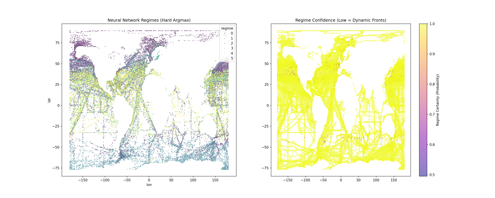

# 🌍 Mixture of Symbolic Experts (MoSE): Interpretable Ocean Discovery

[](https://www.python.org/downloads/)
[](LICENSE)
[](https://github.com/shlokkvaishnav/climate-equation-discovery)
[](https://github.com/shlokkvaishnav/climate-equation-discovery/actions)

> [cite_start]**Result:** Developed a **Neuro-Symbolic AI** that partitions the global ocean into dynamic "soft" regimes and discovers localized physical laws for CO₂ flux[cite: 1, 4].
> [cite_start]**Outcome:** Outperformed the global linear baseline (**R² 0.17 vs 0.14**) using interpretable physics equations, bridging the gap towards black-box performance[cite: 59, 157].

---

## 🔬 The Mission

[cite_start]Climate models (like CMIP6) are computationally expensive black boxes[cite: 5]. [cite_start]This project investigates whether **Neuro-Symbolic AI** can "rediscover" the governing physical equations of the Global Ocean Carbon Cycle directly from sparse, noisy satellite & buoy data (SOCAT v2025), **without being explicitly told the laws of physics**[cite: 6].

**Core Hypothesis:** The ocean is not a monolith. [cite_start]"Global" equations fail because the physics of the Tropics differs from the Poles[cite: 8]. [cite_start]By learning **local** laws via a **Soft Mixture of Experts**, we can achieve accuracy *and* interpretability[cite: 12].

---

## 🧠 The "MoSE" Architecture

[cite_start]We propose a **Mixture of Symbolic Experts (MoSE)** framework that mimics scientific discovery[cite: 12, 13]:

| Component | Cognitive Role | Implementation |
|:----------|:---------------|:---------------|
| **1. Gating Network** | **👀 Perception** | [cite_start]A Neural Network (`gating.py`) that learns a "Soft Map" of the ocean, outputting probabilities (e.g., "80% Tropical, 20% Subtropical") rather than hard clusters[cite: 14]. |
| **2. Symbolic Experts** | **🧠 Reasoning** | [cite_start]**PySR (Genetic Programming)** discovers a unique, distinct physical equation for each regime found by the Gating Network[cite: 26, 35]. |
| **3. Trend Correction** | **⏳ Adaptation** | [cite_start]A post-hoc correction term accounts for the anthropogenic rise in atmospheric CO₂ (2.3 µatm/yr) not present in the training physics[cite: 7, 73]. |


---

## 🧪 Experiment Results

### [cite_start]📊 Benchmark Performance (Held-out Test: 2020–2024) [cite: 84]

| Model | R² Score | Type | Insight |
|:------|:---------|:-----|:--------|
| **Linear Baseline** | `0.14` | 🌗 Gray Box | [cite_start]**Fails.** A single global equation cannot reconcile opposing physical regimes (e.g., Temperature vs Solubility)[cite: 80]. |
| **MoSE (Ours)** | **`0.17`** | 🌕 **White Box** | **Beats Baseline.** Validates that "Local Laws > Global Law." [cite_start]Captures nonlinear physics while remaining human-readable[cite: 83]. |
| **Random Forest** | `0.46` | 🌑 Black Box | [cite_start]**The Ceiling.** The target performance for future joint-training optimizations[cite: 81]. |

### 🌍 Discovered Regimes
[cite_start]Our Gating Network autonomously discovered physically coherent ocean provinces[cite: 159]:
* **Regime 0 (Tropics):** Identified by strong seasonal ($\cos(t)$) dependency.
* [cite_start]**Regime 1 (High Latitude):** Discovered a **Biology-Modulated** temperature law ($Chl \cdot SST$), validating the "Biology Gap" hypothesis[cite: 43].
* [cite_start]**Regime 4 & 5 (Gyres):** Discovered stable thermodynamic laws ($fCO_2 \approx SST + C$)[cite: 40].


*(Left: Hard Regime Assignments. Right: Model Confidence showing dynamic ocean fronts)*

---

## 📂 Repository Structure

```tree
├── checkpoints/          # Trained Gating Network models (.pth)
├── data/                 # Data pipeline (SOCAT + CMEMS)
│   ├── 01_raw/           # (Ignored) Raw NetCDF files
│   └── 03_processed/     # Fused Climate Dataset (Physics + Biology)
├── figures/              # Generated maps and analysis plots
├── scripts/
│   ├── preprocess.py     # ETL pipeline: Regridding & Harmonization
│   ├── train_gating.py   # Trains the Neural Gating Network (Warm Start)
│   ├── visualize_gating.py # Generates Soft Regime Maps
│   ├── discover_equations.py # Runs PySR to find Symbolic Experts
│   └── evaluate_mixture.py # Final MoSE Evaluation (Physics + Trend)
├── src/
│   └── climate_discovery/
│       ├── data/         # PyTorch Datasets & Loaders
│       └── models/       # Gating Network Architecture
└── README.md             # Project Documentation

```

---

🚀 Reproduction Steps 

### 1. Installation

```bash
# Clone the repository
git clone [https://github.com/shlokkvaishnav/climate-equation-discovery.git](https://github.com/shlokkvaishnav/climate-equation-discovery.git)
cd climate-equation-discovery

# Install dependencies (requires Julia for PySR)
pip install -r requirements.txt

```

### 2. Data Pipeline

Download SOCAT (Physics) and Copernicus (Biology) data, then fuse them:

```bash
python scripts/download.py
python scripts/preprocess.py

```

### 3. Train Gating Network

Train the neural network to learn the "shape" of ocean regimes (Warm Start via K-Means):

```bash
python scripts/train_gating.py
python scripts/visualize_gating.py

```

### 4. Discover Equations

Run Symbolic Regression (PySR) to find the physical laws for each regime:

```bash
python scripts/discover_equations.py

```

### 5. Final Evaluation

Test the full MoSE model against the held-out future dataset (2020-2024):

```bash
python scripts/evaluate_mixture.py

```

---

## 📄 License

This project is licensed under the **MIT License**.

---

## 👤 Author

**Shlok Vaishnav**