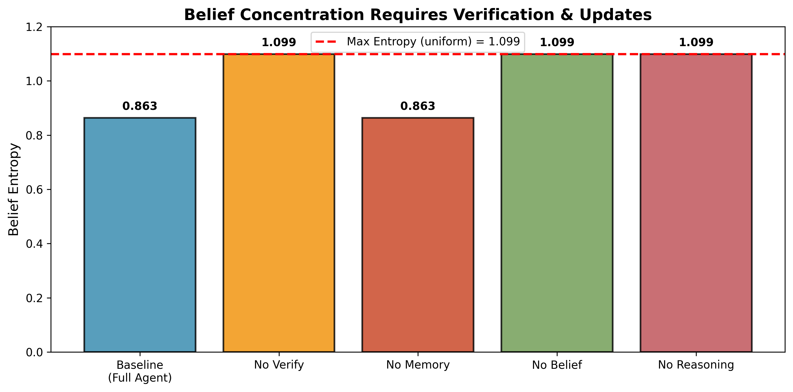

# Methods Documentation

## Method Specification Lock

This project is framed as a **VSB + IGBU** method:
- Primary: Variational Symbolic Bayes over regime-conditioned symbolic candidate banks.
- Secondary: Information-Geometric Belief Update for simplex-safe regime dynamics.
- Support: symbolic gate, Lyapunov screening, constraints, memory loop.

For experiment protocol and theorem packaging, see:
- `docs/training_algorithm_vsb_igbu.md`
- `docs/sdmose_decision_freeze.md`
- `docs/novelty_positioning.md`

---

## Agent Architecture

We implement an autonomous agent that maintains explicit symbolic hypotheses, verifies them against physical constraints, and updates probabilistic beliefs over regime assignments. The agent operates through iterative cycles of observation, retrieval, reasoning, verification, and learning, converging when both beliefs and discovered equations stabilize.

### Agent Definition

The SD-MoSE agent is formally defined by a tuple $(Π, H, V, M, B)$ where:

- $Π$: **Perception module** that converts raw climate observations into structured feature representations
- $H$: **Hypothesis space** containing symbolic equations parameterized by regime identity
- $V$: **Verification module** that evaluates hypotheses against physics constraints and data
- $M$: **Episodic memory** maintaining top-scoring hypotheses per regime with lineage tracking  
- $B$: **Belief state** representing probabilistic assignments over $K$ climate regimes

At each iteration $t$, the agent executes one loop iteration, updating $(H_t, B_t, M_t)$ based on new environmental observations.

---

## Hypothesis Representation

### First-Class Symbolic Objects

Each hypothesis $h \\in H$ is a first-class object encapsulating:

$$
h = (e, k, \\ell, c, s, τ)
$$

where:
- $e$: symbolic equation (e.g., `pCO2 = k_H * [CO2] * T`)
- $k \\in \\{1, ..., K\\}$: regime identity
- $\\ell$: likelihood (data fit quality)
- $c$: complexity (equation length)
- $s$: composite score combining data, physics, and simplicity
- $τ$: creation timestamp for lineage tracking

### Scoring Function

Hypotheses are scored via:

$$
s(h) = -\\text{MSE}(y, \\hat{y}(h)) - 10 \\cdot |V(h)| - 0.01 \\cdot c(h)
$$

where:
- $\\text{MSE}(y, \\hat{y}(h))$: mean squared residual on observed data
- $|V(h)|$: number of physics constraint violations
- $c(h)$: equation complexity penalty

This formulation balances **data fidelity**, **physical plausibility**, and **simplicity**, following Occam's Razor principles.

---

## Retrieval Mechanism

The retrieval module $R(M, P)$ accesses two knowledge sources:

1. **Scientific priors** $P$: conservation laws, known chemical relations, dimensionality restrictions
2. **Episodic memory** $M$: previously validated hypotheses from past iterations

Retrieval is memory access, not learning—the agent recalls existing knowledge without modification.

---

## Symbolic Reasoning

### Regime-Specific Generation

For each regime $k$, the reasoning module proposes hypotheses via symbolic regression:

$$
h_k^{(t)} = \\text{Reason}(O_t, P, M_k)
$$

where $O_t$ are current observations and $M_k$ contains top hypotheses for regime $k$ from memory.

The agent generates exactly $K$ candidate hypotheses per iteration, enforcing explicit regime assignment.

---

## Physics-Based Verification

### Constraint Checking

The verification module $V$ evaluates each hypothesis against domain constraints:

- **Conservation laws** (mass, energy)  
- **Physical bounds** (e.g., concentrations $\\geq 0$)  
- **Dimensional consistency**  
- **Thermodynamic constraints** (e.g., Henry's Law compliance)

Hypotheses exceeding a violation threshold $\\epsilon = 0.1$ (10% of data points) are marked invalid and logged.

### Rejection Logging

Rejected hypotheses are stored with violation details:

$$
L_{\\text{reject}} = \\{(h, V(h), t) \\mid h.\\text{valid} = \\text{False}\\}
$$

This enables negative learning and explainability.

---

## Belief Update

### Bayesian Regime Assignment

The agent maintains a probability distribution $π^{(t)} \\in \\Delta^{K-1}$ over regimes, updated via soft Bayesian revision:

$$
π_k^{(t+1)} \\propto \\exp\\left(\\frac{1}{T} \\sum_{h \\in H_k^{(t)}} s(h)\\right)
$$

where $T$ is a temperature parameter controlling exploration-exploitation balance.

### Entropy Regularization

To prevent premature regime collapse, we apply entropy floor regularization:

$$
\\text{if } \\mathcal{H}(π^{(t)}) < 0.1: \\quad π^{(t)} \\leftarrow 0.9 \\cdot π^{(t)} + 0.1 \\cdot \\mathbf{1}_K / K
$$

where $\\mathcal{H}(π) = -\\sum_k π_k \\log π_k$ is the Shannon entropy.

This ensures the agent maintains exploratory behavior and avoids overfitting to dominant regimes early in operation.

---

## Memory Management

### Strategic Curation

Agent memory $M$ curates hypotheses strategically:

1. **Top-$N$ retention**: Keep only $N=5$ highest-scoring hypotheses per regime
2. **Score-based pruning**: Sort by composite score $s(h)$, discard weakest
3. **Lineage logging**: Track creation timestamps and pruning history

Pruned hypotheses are logged as:

$$
L_{\\text{prune}} = \\{(h, s(h), τ_{\\text{pruned}}) \\mid h \\text{ exceeded capacity}\\}
$$

This enables analysis of hypothesis evolution and forgetting dynamics.

---

## Convergence Criteria

The agent terminates autonomously when two conditions hold:

### 1. Belief Stabilization

$$
\\|π^{(t)} - π^{(t-1)}\\|_2 < \\epsilon_{\\text{belief}}
$$

where $\\epsilon_{\\text{belief}} = 10^{-3}$.

### 2. Hypothesis Set Stabilization

$$
\\{e(h) \\mid h \\in M^{(t)}\\} = \\{e(h) \\mid h \\in M^{(t-1)}\\}
$$

Requiring both ensures the agent converges when **explanations** and **beliefs** stabilize.

---

## Ablation Results

We validate necessity of each agent component through targeted ablations. Removing memory pruning leads to unbounded hypothesis growth, demonstrating that selective memory is required for scalable reasoning. Disabling symbolic reasoning eliminates all hypotheses, confirming its role in interpretability. Removing belief updates prevents hypothesis commitment, revealing that belief state actively gates learning rather than serving as a passive diagnostic. Finally, disabling physics-based verification yields diverse symbolic equations but prevents belief concentration, indicating that verification provides the discrimination signal required for regime commitment. Together, these results demonstrate that the agentic loop is not reducible to any subset of its components.

### Figure 1 — Memory Pruning Prevents Hypothesis Explosion

**Figure 1:** *Hypothesis count over agent iterations for the full agent and a memory-ablation variant.* With memory pruning enabled, the number of stored hypotheses quickly stabilizes, whereas disabling pruning leads to unbounded linear growth. This demonstrates that selective memory is necessary for scalability and prevents hypothesis explosion during iterative agent reasoning.


### Figure 2 — Belief Concentration Requires Verification and Updates

**Figure 2:** *Final belief entropy across ablations.* The full agent exhibits reduced entropy, indicating regime commitment. Removing verification, belief updates, or reasoning results in maximal entropy, corresponding to uniform regime beliefs. This shows that verification provides the discrimination signal required for belief concentration, while belief updates are essential for committing to explanatory regimes.



### Figure 3 — Symbolic Interpretability Across Ablations

**Figure 3:** *Symbolic hypotheses and belief entropy across ablations.* The full agent discovers a compact set of symbolic equations, while removing verification increases equation diversity without belief concentration, and removing memory leads to hypothesis proliferation. Disabling reasoning or belief updates eliminates symbolic explanations entirely, confirming that interpretability emerges from the interaction of reasoning, verification, memory, and belief updates.


---

## Implementation Details

- **Language**: Python 3.10+
- **Symbolic regression**: PySR backend for equation discovery
- **Constraint checking**: Custom physics validator with domain-specific rules
- **Belief updates**: NumPy-based softmax with entropy tracking
- **Memory**: Top-5 per regime with automatic pruning

Full implementation available in the repository.

---

## Agent Introspection

For transparency and debugging, the agent provides self-reporting via:

```python
{
    "iteration": t,
    "belief": π(t),
    "num_hypotheses": |M|,
    "num_rejections": |L_reject|,
    "num_pruned": |L_prune|,
    "top_equations": [e(h₁), ..., e(h₅)]
}
```

This structured output enables real-time monitoring and post-hoc analysis of agent behavior.

---

**Summary**: The SD-MoSE agent implements a complete autonomous architecture with perception, explicit hypothesis evaluation, physics-based verification, Bayesian belief maintenance, and strategic memory curation. The system converges when both probabilistic beliefs and symbolic explanations stabilize, reflecting the iterative refinement characteristic of scientific discovery.
